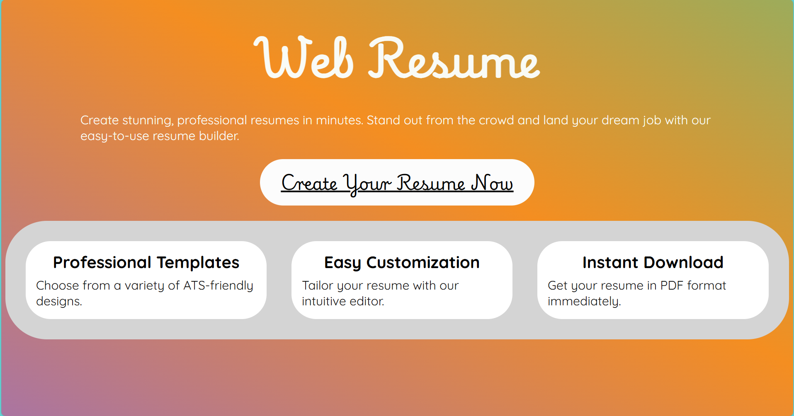
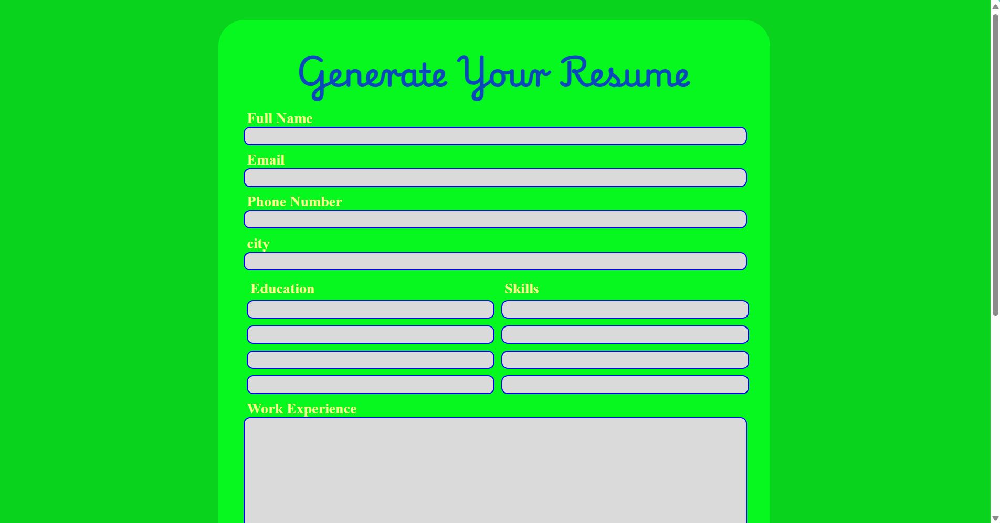

# Web Resume Project

Welcome to the Web Resume Project! This repository contains the source code for a personal web-based resume, which showcases your skills, experience, education, and projects in a visually appealing and interactive format. 

## Table of Contents

- [Screenshots](#screenshots)
- [Features](#features)
- [Technologies Used](#technologies-Used)
- [Installation](#installation)


## Screenshots

### Home Page


### Form



## Features

## Technologies Used

- **Frontend**: HTML, Javascript
- **Backend**: EJS
- **Styling**: CSS

## Installation

1. **Clone the repository:**

   ```bash
   git clone git@github.com:Kavyansh-Saini/HTML-Co-Project.git
   ```

2. **Navigate to the project directory::**

    ```bash
    cd HTML-Co-Project
   ```

3. **Install dependencies:**

   ```bash
   npm i ejs
   ```
4. **Run the server:**

   ```bash
   nodemon server.js
   ```
The web resume will be available at `http://localhost:3000`.
